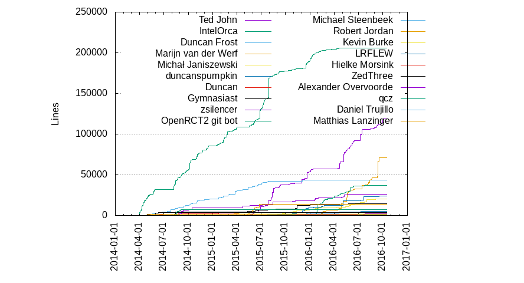

# Report 1: Software Processes in OpenRCT2

## Index
1. [Brief description](#brief)
2. [Development Process](#development_process)
	1. [Initial development](#initial_development)
	2. [Current development](#current_development)
3. [Opinions, critics and alternatives](#opinions)

## Brief description 
RollerCoaster Tycoon 2 (RCT2) was a construction and management simulation computer game lauched in 2002 where you played as an amusement park manager. Over the years the official game support finally got to an end which prompted the arise of a fan-made project, led by Ted 'IntelOrca' John, with the intent of reverse engineering the original RCT2 executable.
The OpenRCT2 project was then launched in April 2014 with the set goals of:
* Porting the game into platform independent C source code, making the game available to more platforms;
* Fix [bugs][1] the lasted over the years on the no longer supported game;
* Add [translations][2] to the game's user interface;
* Add support for higher resolution to accommodate for nowadays technology;
* Add online multiplayer functionality;
* And other minor [features][3] like simulation speed increase and twitch integration...

[1]: https://github.com/OpenRCT2/OpenRCT2/wiki/Found-bugs-and-limitations-in-RCT2
[2]: https://github.com/OpenRCT2/OpenRCT2/wiki/Language-support
[3]: http://openrct2.org/features

At the time of writing, the project is hosted on GitHub under GPLv3 license and requires the original game files to run (mainly resources and content). It's core language is C, with some bits of C++ along the way, and it has accumulated 142 contributors and almost 10,000 commits along the years.

**Fig1-** Lines of code per language over time graph.

**Fig2-** Lines of code per language graph.

## Development Process 
### Initial development 
Having its roots in the hands of a single person, it didn't start with a specific development process. However, it was reverse engineered *(1)* from the original game executable in an interesting way: a single function was re-implemented from the executable at a time and, by use of regression testing against the original game, tested to make sure it does what it's supposed to do.

*(1)* Reverse engineering is the process of collecting information about an object as to check/understand its functionality. In software, reverse engineering is the act of reverting the machine code of a program back to its source code form with either of the following objectives:
* Study how a program works;
* The original source code was lost and we want to recover it;
* Boost a program's performance;
* Correct eventual bugs;
* Identify malicious code on a program;
* Improve it's portability.

*In the OpenRCT2 project most of these apply.*

### Current development 
At the current time, there are many collaborators for the project's evolution, even though the founder continues to be the largest contributor. The contributors join together in a chatroom (gitter.im) to exchange ideas about the project itself and the various improvements that can be done to it.
Periodically, new stable releases are launched, with several updates and bugfixes.

The project uses the gitflow workflow. It's centered around the use of a vast set of new commands, each executing a group of tasks in a predefined order. This does not replace git, it's only a set of scripts that use the standard git commands in a smart way. It's possible to use the standard git commands, in the correct order and with the right arguments, to follow a specific workflow. However, using gitflow it is not necessary to memorize these.

## Opinions, critics and alternatives 
Initially, the project was started by a single person. This is not necessarily a bad thing. However, compared to other C projects, which have 19% of all source code lines as comments, OpenRCT2 has 7%, which could mean that the code isn't well-documented and organized, according to [openhub](https://www.openhub.net/p/OpenRCT2/factoids#FactoidCommentsVeryLow).

This might prove as a barrier to entry for new developers. There might also be a case of low interest in the project, as the original game is able to run on the Windows operating system acceptably.

**Fig3-** Lines of code by author graph, generated by the program 'gitstats'.

As we can see in the graph, it's clear that most of the contributions have been done by a single person, who goes by 2 usernames: "Ted John" and "IntelOrca". Despite this, we can see that the situation has improved: the number of authors who have made a significant contribution in terms of lines of code has been steadily rising the past year, which is a good sign. A total of 130 developers have contributed code to OpenRCT2 in the last year, which shows interest by the open source community in developing it further.

It's clear there is a low amount of project planning, which makes it harder for new developers to contribute, as it is hard to know where to get started.
Moreover, having decent planning leads to a significant increase of efficiency of individual contributors. This can be achieved by improving the following areas:
* Coordination between contributors;
* Good environment;
* Work getting tracked over time (such as progress, time cost, etc);
* Guide the work in order to know exactly what to do next.

In the end, having a good software development process is essential to manage a project of such a size well, especially in the open-source world, where a low barrier to entry is especially important.

## Contributions
All 4 group members have contributed evenly to the report:

* João 'TUTAMKHAMON' Ferreira.
* Jorge 'Jorge2210' Ferreira.
* Pedro 'n42k' Amaro.
* Pedro 'Oshnira' Lima.

### TODO:
	Is there any development process?
